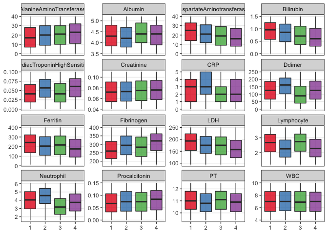
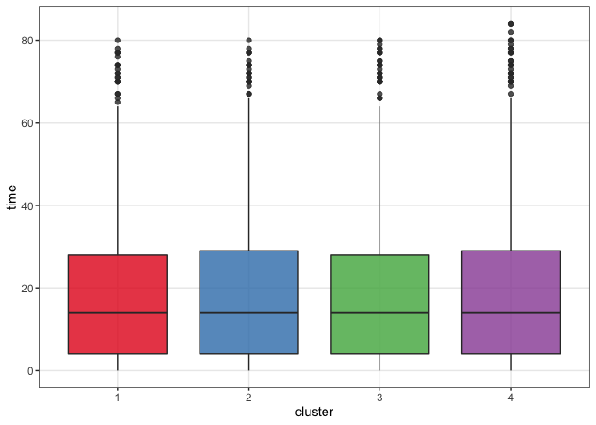

An example workflow
================

The {tdapseudotime} :package: contains functions to implement the
temporal phenotyping via topological data analysis.

You can install the development version of tdapseudotime from GitHub
with remotes:

``` r
# install.packages('remotes') # uncomment to install devtools
remotes::install_github('trang1618/tdapseudotime')
```

``` r
library(tdapseudotime)
library(igraph)
library(mice)
library(dplyr)
library(tidyr)
library(ggplot2)

set.seed(1234)
```

## Preprocess

Parameters:

``` r
my_file <- 'MyDataSim.csv'

# TDA hyperparameter grid
intervals_seq <- seq(5, 10, 1)
overlaps_seq <- seq(50, 60, 10)
clust_bins <- c(6, 8, 10)
ii <- 2
p <- 2
b <- 2
num_intervals <- c(intervals_seq[ii], intervals_seq[ii])
percent_overlap <- overlaps_seq[p]
num_bins_when_clustering <- clust_bins[b]
```

Color palette for enrichment: blue \> green \> yellow \> orange \> red

``` r
# RColorBrewer::brewer.pal(length(unique(CommunityCluster$membership)), "Set1")
my_colors <- c("#00A3DD", "#60C659", "#FFBC21", "#FF7F1E", "#EF2B2D")
```

## Read in data file

Create a time line for each subject (being time zero the first
observation). Extract lab values to be used for TDA distance matrix.

Check format: - first col \> row id “id” (can be any value, i.e. unique
row number) - second col \> pts id “covid\_id” - third col \> date “day”

*Need to check whether rowid is important*

``` r
FupData <- read.csv(my_file, header = TRUE, colClasses = "character")
non_lab_value_names <- c('id', 'covid_id', 'day')
lab_value_names <- setdiff(names(FupData), non_lab_value_names)

processed_data <- FupData %>% 
  mutate(day = as.Date(day, format = '%Y-%m-%d')) %>% 
  group_by(covid_id) %>% 
  mutate(first_date = min(day)) %>% 
  ungroup() %>% 
  mutate(id = as.integer(id),
         time = as.numeric(day - first_date, units = 'days')) %>% 
  arrange(covid_id, time) %>% 
  mutate_at(dplyr::all_of(lab_value_names), as.numeric)
```

``` r
lab_values_mat <- processed_data[, lab_value_names] %>% 
  mice::mice(m = 5, maxit = 50, meth = 'pmm', seed = 500) %>% # imputation
  complete(1) %>% 
  scale() # prepare for cosine similarity calculation
```

## Run TDA Mapper

``` r
f_sim_map <- map_tda(lab_values_mat)
f_graph <- make_tda_graph(
  f_sim_map, 
  data = processed_data, 
  enrich_var = 'time', # enrich topology by time for now
  color_method = 'clust_color',
  my_colors = my_colors
)
```

<!-- -->

## Create a minimum spanning tree

and compute trajectories and assign observations to nodes in network
\#\#\# THIS STEP NEED MANUAL REVIEW Check the MST plot and TIME boxplots

``` r
out_trajectories <- find_trajectories(processed_data, f_sim_map, f_graph)
```

<!-- -->

    ##                                     trajElmnts clusterTraj
    ## 1                    3 2 1 7 13 14 15 16 17 18         1>2
    ## 2                                 4 5 11 12 18           2
    ## 3                                      6 12 18           2
    ## 4                              8 9 10 16 17 18         1>2
    ## 5          20 19 25 31 32 33 34 35 36 30 24 18       3>4>2
    ## 6       21 27 26 25 31 32 33 34 35 36 30 24 18       3>4>2
    ## 7 23 22 28 27 26 25 31 32 33 34 35 36 30 24 18     4>3>4>2
    ## 8    29 28 27 26 25 31 32 33 34 35 36 30 24 18     4>3>4>2

``` r
similarity_df <- out_trajectories[[1]]
id_node_cluster <- out_trajectories[[2]]
most_similar_traj <- similarity_df %>%
  group_by(covid_id) %>%
  slice(which.max(SJ)) # use Jaccard similarity

head(most_similar_traj, 10)
```

    ## # A tibble: 10 x 11
    ## # Groups:   covid_id [10]
    ##    covid_id trajPaz trajPazclusters trajNumb trajElmnts trajLenght    SJ    SI
    ##    <chr>    <chr>   <chr>              <int> <chr>           <int> <dbl> <dbl>
    ##  1 1        26 27 … 3 4                    8 29 28 27 …         14 0.429 1    
    ##  2 10       20 21 … 3 4 1 2                7 23 22 28 …         15 0.381 0.242
    ##  3 100      23 24 … 4 1 3                  8 29 28 27 …         14 0.524 0.611
    ##  4 101      13 14 … 1 3 2 4                7 23 22 28 …         15 0.424 0.117
    ##  5 102      9 10 1… 1 2 3 4                8 29 28 27 …         14 0.276 0.229
    ##  6 103      20 21 … 3 4 1 2                7 23 22 28 …         15 0.519 0.275
    ##  7 104      3 4 5 … 1 2 3 4                8 29 28 27 …         14 0.261 0.333
    ##  8 105      4 5 6 … 2 3 1 4                7 23 22 28 …         15 0.333 0.297
    ##  9 106      14 15 … 1 2 3 4                1 3 2 1 7 1…         10 0.28  0.163
    ## 10 107      27 28 … 3 4                    8 29 28 27 …         14 0.429 0.5  
    ## # … with 3 more variables: SL <dbl>, JW <dbl>, clusterTraj <chr>

## Write output

``` r
data_out <- most_similar_traj %>% select(covid_id, clusterTraj)
table(data_out$clusterTraj)
```

    ## 
    ##     1>2       2   3>4>2 4>3>4>2 
    ##     184      17      36     311

## Visualizations

``` r
plot_dat <- processed_data %>% 
  left_join(id_node_cluster %>% distinct(covid_id, id, cluster), 
            by = c('id', 'covid_id'))

plot_dat %>% 
  ggplot(aes(x = cluster, y = time, fill = cluster)) +
  geom_boxplot(alpha = 0.8) + 
  scale_fill_manual(values = f_graph$pal$color) + 
  scale_color_manual(values = f_graph$pal$color) +
  theme(legend.position = "none",
        plot.title = element_text(size = 8, hjust = 0.5))
```

<!-- -->

``` r
plot_dat %>% 
  select(cluster, all_of(lab_value_names)) %>% 
  pivot_longer(- cluster, names_to = 'Lab', values_to = 'lab_value') %>% 
  ggplot(aes(x = cluster, y = lab_value, fill = cluster)) +
  geom_boxplot(alpha = 0.8) + 
  labs(x = NULL, y = NULL) +
  scale_fill_manual(values = f_graph$pal$color) + 
  scale_color_manual(values = f_graph$pal$color) +
  theme(legend.position = "none") +
  facet_wrap(~ Lab, scales = 'free_y')
```

<!-- -->

``` r
processed_data_traj <- processed_data %>% 
  left_join(most_similar_traj, by = c("covid_id")) %>% 
  mutate(clusterTraj = as.factor(clusterTraj), time) %>%
  select(time, clusterTraj, all_of(lab_value_names)) %>% 
  distinct()
```

``` r
processed_data_traj  %>% 
  pivot_longer(- c(time, clusterTraj), 
               names_to = 'Lab', values_to = 'lab_value') %>% 
  ggplot(aes(time, lab_value, colour = clusterTraj, 
             group = clusterTraj, fill = clusterTraj)) +
  geom_smooth(method = "loess") +
  theme(legend.position = "none") +
  facet_wrap(~ Lab, scales = 'free_y')
```

    ## `geom_smooth()` using formula 'y ~ x'

<!-- -->

Please [open an
issue](https://github.com/trang1618/tdapseudotime/issues/new) for
questions related to **tdapseudotime** usage, bug reports or general
inquiries.

Thank you very much for your support\!
